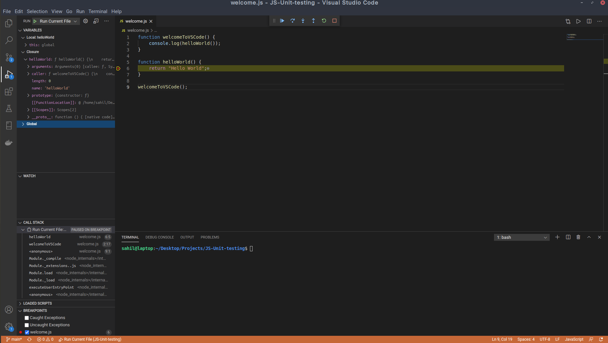
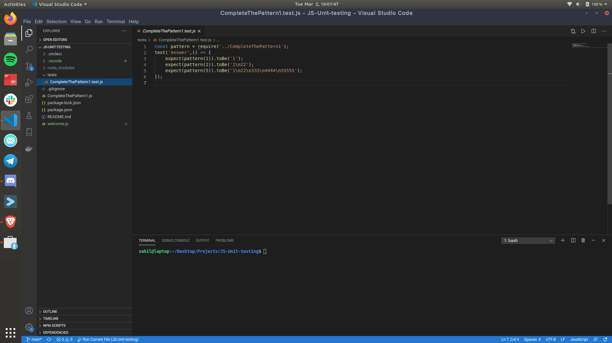
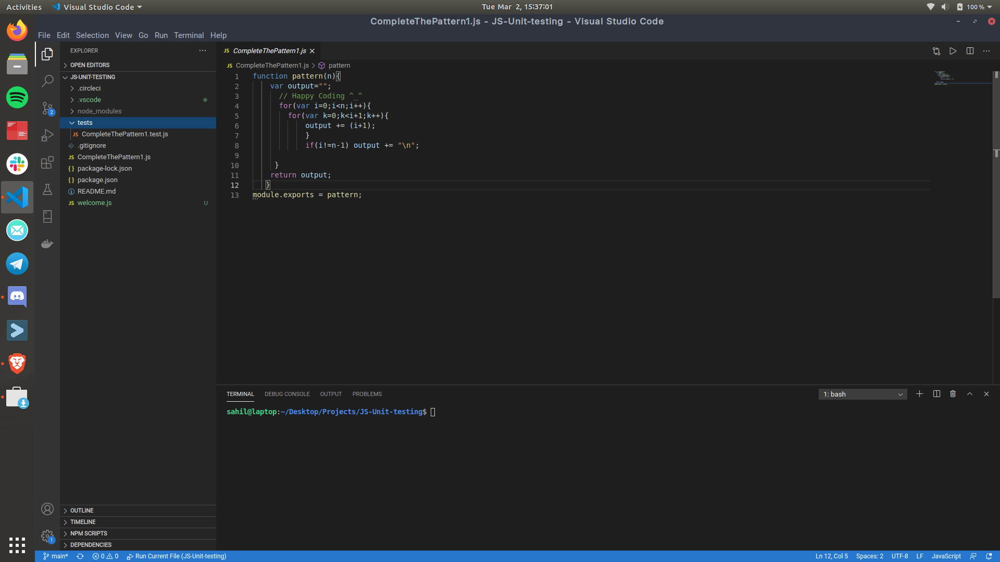
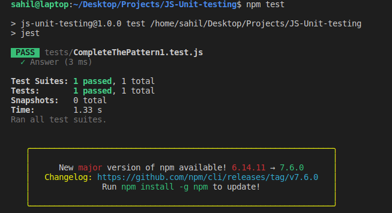

# Software testing and debugging tools (Roll No : 19115071)

This repository is an example repository for showing testing tools in JavaScript for Software Engineering Term Paper by roll number 19115071.
My term paper title for the subject software engineering is “**Debugging and testing tools**” . I chose this topic because I found it quite interesting to make code error free and how the testing functionality works. This paper also covers the types of tests and debugging tools used in the modern workspace.

Introduction
============

This paper consists of insight on two main topics:

-   **Debugging**: It is the process of finding and resolving bugs (defects or problems that prevent correct operation) within computer programs, software, or systems. Debugging tactics can involve interactive debugging, control flow analysis, unit testing, integration testing, log file analysis, monitoring at the application or system level, memory dumps, and profiling. Many programming languages and software development tools also offer programs to aid in debugging, known as debuggers.

-   **Testing**: Software testing is a crucial part of software development, it ensures that the software been developed performs all functional requirements and is free from any form of defect and errors. This ensures that the software is of good quality and standard. While testing a software, it is important to be time and cost conscious.

    This reason has made most testers switch from the manual testing process to automation of software testing, to reduce time and cost. But then selecting a software testing tool for automated testing that best fit a project is important yet challenging task, the objective of this paper is to evaluate some of the most used software testing tool, identify their strength and weakness and also the field where they can be employed, either for mobile testing, web service testing or both.

    It was observed that there is no one perfect tool for testing, but for a particular testing purpose, tradeoffs can be made to select the best tool depending on the size of the project, the budgeted cost for testing, the platform of the application and also the language that is used to develop the project

Body
====

Software debugging and testing has always been a need for developing high end production applications in the software world. It all began with Glenford J. Myers when he introduced the separation of debugging from testing in 1979. Although his attention was on breakage testing (“A successful test case is one that detects an as-yet undiscovered error.”), it illustrated the desire of the software engineering community to separate fundamental development activities, such as debugging, from that of verification.

Debugging
---------

Let’s move on to debugging insights:

-   **Debugging Process**: Steps involved in debugging are:

    -   Problem identification and report preparation of the product (initial phase).

    -   Assigning the report to software engineer to the defect to verify that it is genuine.

    -   Defect Analysis using modeling, documentations, finding and testing candidate flaws, etc.

    -   Defect Resolution by making required changes to the system.

    -   Validation of corrections.

-   **Debugging Strategies**:

    -   Study the system for the larger duration in order to understand the system. It helps debugger to construct different representations of systems to be debugging depends on the need. Study of the system is also done actively to find recent changes made to the software.

    -   Backwards analysis of the problem which involves tracing the program backward from the location of failure message in order to identify the region of faulty code. A detailed study of the region is conducting to find the cause of defects.

    -   Forward analysis of the program involves tracing the program forwards using breakpoints or print statements at different points in the program and studying the results. The region where the wrong outputs are obtained is the region that needs to be focused to find the defect.

    -   Using the past experience of the software debug the software with similar problems in nature. The success of this approach depends on the expertise of the debugger.

-   **Debugging Tools:** Debugging tool is a computer program that is used to test and debug other programs. A lot of public domain software like gdb and dbx are available for debugging. They offer console-based command line interfaces. Examples of automated debugging tools include code based tracers, profilers, interpreters, etc.

    Some of the widely used debuggers are:

    -   Radare2

    -   WinDbg

    -   Valgrind

Testing
-------

Testing is the process of executing a program with the aim of finding errors. To make our software perform well it should be error-free. If testing is done successfully it will remove all the errors from the software. Testing ensures that what you get in the end is what you wanted to build. We check out if there is any problem, any error in the system, which can make software unusable by the client. This helps in the prevention of errors in a system.

-   **Principles**

    -   All the test should meet the customer requirements

    -   To make our software testing should be performed by a third party

    -   Exhaustive testing is not possible. As we need the optimal amount of testing based on the risk assessment of the application.

    -   All the test to be conducted should be planned before implementing it

    -   It follows the Pareto rule(80/20 rule) which states that 80% of errors come from 20% of program components.

    -   Start testing with small parts and extend it to large parts.

-   **Types of testing**

    -   **Unit Testing :** It focuses on the smallest unit of software design. In this, we test an individual unit or group of interrelated units. It is often done by the programmer by using sample input and observing its corresponding outputs.

    -   **Integration Testing :** The objective is to take unit tested components and build a program structure that has been dictated by design. Integration testing is testing in which a group of components is combined to produce output.

        Integration testing is of four types:

        -   Top-down

        -   Bottom-up

        -   Sandwich

        -   Big-Bang

        (a) **Black Box testing**: It is used for validation. In this we ignore internal working mechanism and focuses on what is the output?.

        (b) **White Box testing**: It is used for verification. In this we focus on internal mechanism i.e. how the output is achieved?

    -   **Regression Testing :** Every time a new module is added leads to changes in the program. This type of testing makes sure that the whole component works properly even after adding components to the complete program.

    -   **Smoke Testing :**  This test is done to make sure that software under testing is ready or stable for further testing It is called a smoke test as the testing an initial pass is done to check if it did not catch the fire or smoke in the initial switch on.

    -   **Alpha Testing :** This is a type of validation testing. It is a type of acceptance testing which is done before the product is released to customers. It is typically done by QA people.

    -   **Beta Testing :** The beta test is conducted at one or more customer sites by the end-user of the software. This version is released for a limited number of users for testing in a real-time environment

    -   **System Testing :** This software is tested such that it works fine for the different operating systems. It is covered under the black box testing technique. In this, we just focus on the required input and output without focusing on internal working. In this, we have security testing, recovery testing, stress testing, and performance testing

    -   **Stress Testing :** In this, we give unfavorable conditions to the system and check how they perform in those conditions. Example:

        -   Test cases that require maximum memory or other resources are executed

        -   Test cases that may cause thrashing in a virtual operating system

        -   Test cases that may cause excessive disk requirement

    -   **Performance Testing :** It is designed to test the run-time performance of software within the context of an integrated system. It is used to test the speed and effectiveness of the program. It is also called load testing. In it we check, what is the performance of the system in the given load.

    -   **Object-Oriented Testing :** This testing is a combination of various testing techniques that help to verify and validate object-oriented software. This testing is done in the following manner:

        -   Testing of Requirements

        -   Design and Analysis of Testing

        -   Testing of Code

        -   Integration testing

        -   System testing

        -   User Testing

        .

Tools for debugging
-------------------

To demonstrate the debugging process we will first create a basic JavaScript file with two functions namely, *welcomeToVSCode()* and *helloWorld()*

-   **welcomeToVSCode()** This function is a callback function which calls another function inside itself recursively. This function’s core functionality is to print the output of **helloWorld()** function.

-   **helloWorld()** This function is a simple JavaScript function which returns a “Hello World” string.

We will use Node.js’s inbuilt debugger to debug the code.

Node.js includes an out-of-process debugging utility accessible via a V8 Inspector and built-in debugging client. To use it, click on the play button with a bug on the left side of the Visual Studio Code and the debugging console will open up, further it has three panels :

-   **Variables:** The variables panel tells us the global, closure and local variables used in the file.

-   **Watch:** The watch panel tells us that which line we are watching.

-   **Call Stack:** The Call Stack panel tells us that when and in which order the functions are getting called in the system.

Tools for testing
-----------------

To demonstrate the testing process we will first create a basic JavaScript file with a function to test:

-   **pattern(n)** This function takes an integer as an input and prints the following pattern as output.

    Let say we have n = 5, then the output will be,

    1
    22
    333
    4444
    55555

To test the file we will first install a testing framework named , after installing the framework we will create another file with the same name as the file to be tested in the folder test/ and with the extension .test.js
After this we will write the testing code inside the test file as, for n = 3 we would write the expected output and match it with the program’s output.

And also the main code should be quoted below, the main code involves the logical part of the problem i.e how to solve and give the output,

After writing the code and test we will write “npm test” to test the code in the terminal, so when we’ll run this we’ll get the result as **“PASS”** if the unit test passes else **“FAIL”** if the code gives wrong output,

Discussion
==========

This section explains why there can be many software testing and debugging tools which have different uses in different test cases. Also the differences between software testing and debugging, the basic difference is that in testing we test the whole software consisting of all test cases and bugs while in debugging we test certain part of the code which is troublesome for the user. Software testing is a process that can be systematically planned and specified. Test case design can be conducted, a strategy can be defined, and results can be evaluated against prescribed expectations. Debugging occurs as a consequence of successful testing. That is, when a test case uncovers an error, debugging is the process that results in the removal of the error. The purpose of debugging is to locate and fix the offending code responsible for a symptom violating a known specification. Debugging typically happens during three activities in software development, and the level of granularity of the analysis required for locating the defect differs in these three.

Conclusion
==========

This paper on Software testing and debugging tools describes about software testing tools, debugging tools , need of software testing and debugging, Software testing goals and principles. To perform testing effectively and efficiently, everyone involved with testing should be familiar with basic software testing goals, principles, limitations and concepts. Debugging is equally important as Testing and shouldn’t be neglected. Many developers face problems in finding the actual problem in the code and debugging solves the purpose of it. Software testing is often less formal and rigorous than it should, and a main reason for that is because we have struggled to define best practices, methodologies, principles, standards for optimal software testing.

References
==========

1. GeeksForGeeks : https://www.geeksforgeeks.org/software-testing-basics/

2. Wikipedia : https://en.wikipedia.org/wiki/Debugging